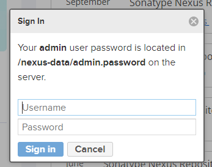
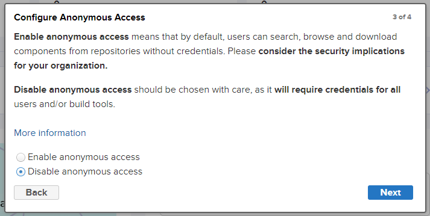
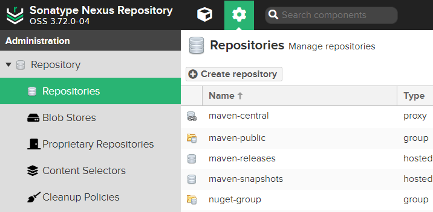
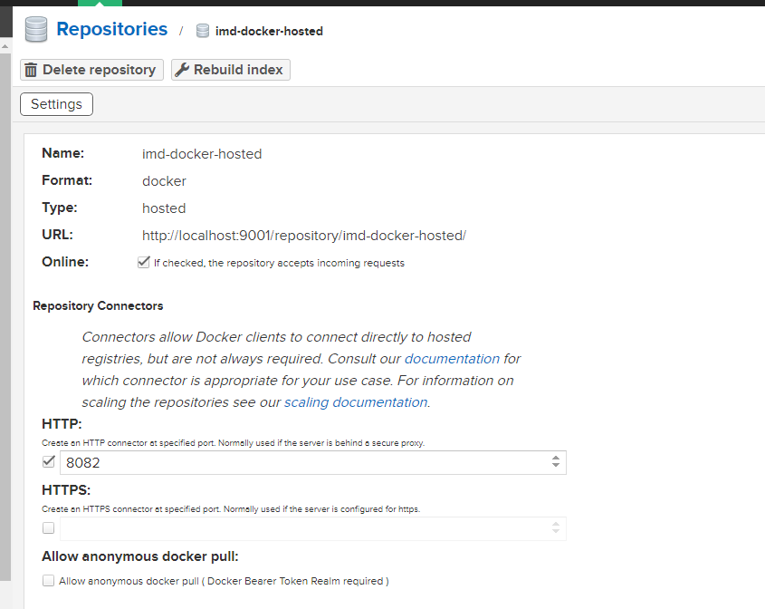
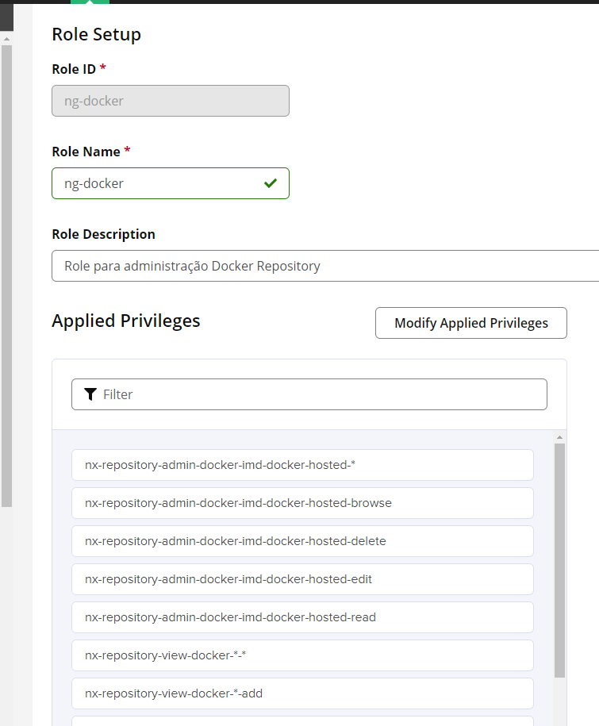
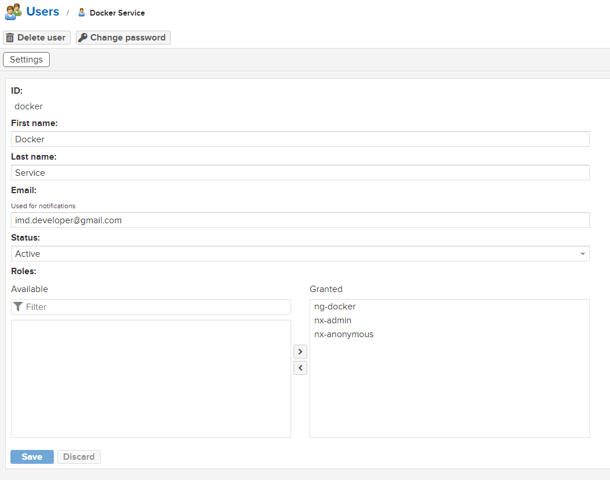
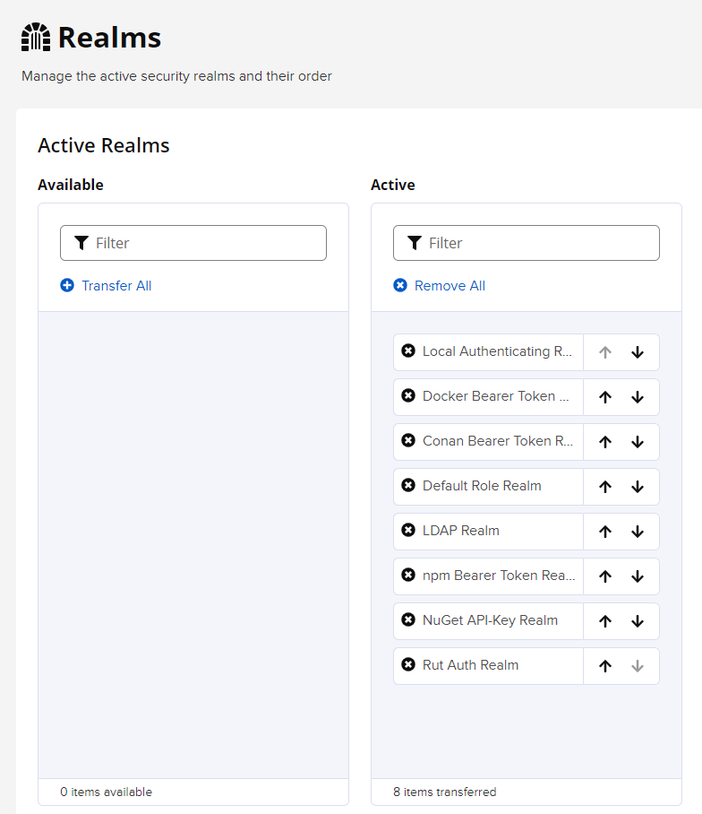
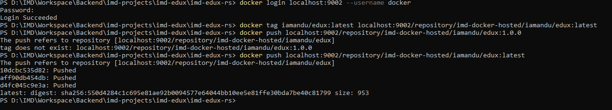
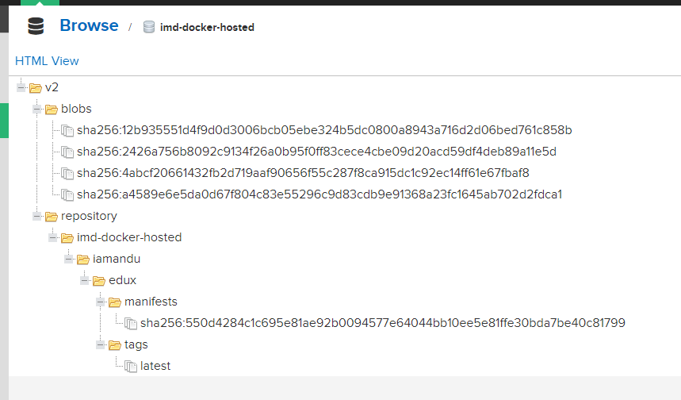
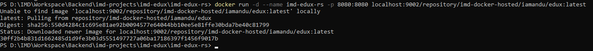

# IMD Nexus

Serviço para exercer o papel de Docker Register, NPM Private Repository e Maven Repository.
Será utilizado para gestão de imagens docker, archetypes maven e componentes Angular e Ionic.

## Criação dos Volumes

-- Nexus

`
docker volume create --name nexus-data --opt type=none --opt device=F:\DockerKubernete\stm-treinamento-docker-kubernetes\samples-apps\imd-nexus\nexus_data --opt o=bind
`

## Docker Compose

Foi gerado o arquivo:

`
docker-compose.yml
`

Para executar, basta executar o seguinte comando:

`
docker-compose up -d
`

O serviço ficará disponível no seguinte contexto:

`
http://localhost:9001/
`

Para parar o serviço pode-se executar:

`
docker-compose down
`

Nos volumes do docker-compose foi utilizados os seguintes parametros para fazer uso dos volumes existentes e criados anteriormente:

`
    nexus-data:
        external: true
        name: nexus-data
`

## Nexus

Ao abrir o serviço pela primeira vez pela uri acima devemos realizar o primeiro login, onde iremos visualizar a seguinte tela:

Como nosso volume foi mapeado para uma pasta local podemos editar o arquivo mencionado e ter acesso a senha de administrador.
Ao logar usando admin e a senha inicial teremos que criar uma nova senha.

Foi inserido para IMD:

default + security + nexus

Após inserir a nova senha de administrador do Nexus será apresentado tela sobre Configure Anonymous Access:

Foi selecionado Disable anonymous access. Portanto ferramentas de build deverão ter usuário registrado.

### Criar Docker Hosted Repository

Para criar um Docker Hosted Repository devemos clicar no botão de administração e em Repository clicar em Create repository, conforme mostrado a seguir:

Devemos selecionar o tipo docker hosted e atribuir Name setar porta HTTP 8082 conforme configurado no docker-compose.yml.

Sendo assim teremos o seguinte endereço de Docker Register:

`
http://localhost:9001/repository/imd-docker-hosted
`

Devemos agora definir uma Role para ser utilizado para publicação no Docker repository. Clica-se em Security/Roles e em Create Role.
Atribuimos Role ID, Role Name, Role Description e aplicamos todos os privilegios relacionados a "docker".

Em seguida clicamos em Security/Users e criamos um usuário docker que deve receber a role ng-docker recém criada.

Foi definido a senha "docker".

Em seguida clicamos em Security/Realms e ativamos Docker Bearer.

Em um terminal podemos então realizar o login via usuário docker:

`
docker login localhost:9002 --username docker
`

Podemos portanto gerar tag para nossas imagens Docker executando por exemplo:

`
docker tag $IMAGE_NAME:latest localhost:9001/repository/imd-docker-hosted/$IMAGE_NAME:latest
`

Por exemplo:

`
docker tag iamandu/edux:latest localhost:9002/repository/imd-docker-hosted/iamandu/edux:latest
`

Agora pode executar o seguinte comando para fazer o pull de uma imagem para o Docker Repository:

`
docker push localhost:9001/repository/imd-docker-hosted/$IMAGE_NAME:latest
`

Por exemplo:

`
docker push localhost:9002/repository/imd-docker-hosted/iamandu/edux:latest
`

Teremos então:

Se formos ao contexto do Nexus Docker Repository.

`
http://localhost:9001/#browse/browse:imd-docker-hosted
`

Devemos visualizar a imagem que foi versionada.

Para confirmar que a imagem está disponível e pode ser utilizada podemos executar:

`
docker run -d --name my-app -p 8080:8080 $REGISTRY/$REPO_NAME/$IMAGE_NAME:latest
`

Por exemplo:

`
docker run -d --name imd-edux-rs -p 8080:8080 localhost:9002/repository/imd-docker-hosted/iamandu/edux:latest
`

Devemos visualizar o seguinte:

### Criar Maven Hosted Repository

