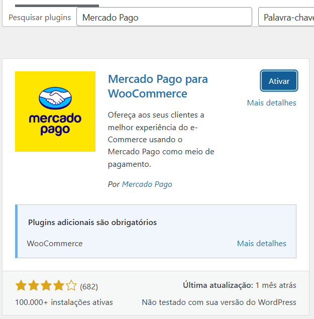
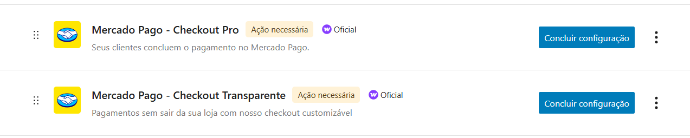

# Meios de Pagamentos

As opções de meios de pagamento mais adequadas ao mercado brasileiro são:

| Gateway             | Vantagens                                    |
| ------------------- | -------------------------------------------- |
| **Mercado Pago**    | Alta conversão, Pix, parcelamento, confiança |
| **Pagar.me**        | Excelente API, bom para escala               |
| **Asaas**           | Ótimo para Pix + Boleto + recorrência        |
| **Stripe (Brasil)** | Bom para cartão, mas Pix ainda limitado      |
| **PagSeguro**       | Alternativa sólida, porém UX inferior        |
| **PagBank**         |                                              |
| **Rappi Bank**      |                                              |

## Mercado Pago

Instalar pela área de plugins buscando pelo nome "Mercado Pago". 



Em seguida em WooCommerce / Configurações / Pagamento e realizar as configurações para cada item desejado.



```
https://woocommerce.com/pt-br/products/mercado-pago-checkout/
```


### Mercado Pago - Checkout Transparente

### 

## Pagar.me

## Asaas

## PagSeguro

## PagBank

## Rappi Bank

## Stripe (Brasil)

## Referências

### Mercado Pago

```
https://www.mercadopago.com.br/developers/pt/docs/woocommerce/overview
```
