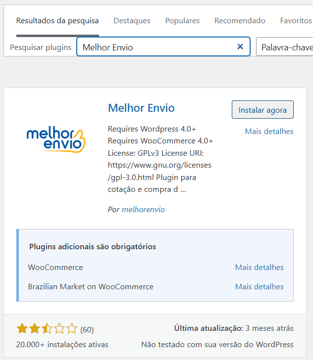
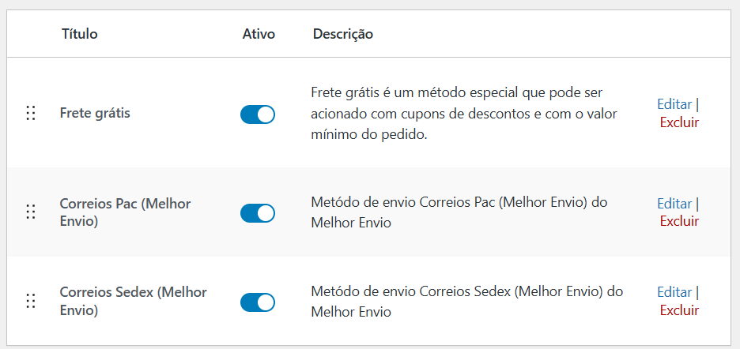

# Frete e Logistica

As opções de frete e logistica mais adequadas ao mercado brasileiro são:

| Plugin                           | Função                                   |
| -------------------------------- | ---------------------------------------- |
| **Melhor Envio**                 | Integra Correios + transportadoras       |
| **Frenet**                       | Simulador de frete multi-transportadoras |
| **Correios Oficial WooCommerce** | Opção básica                             |
| **SuperFrete**                   | Simples e barato para PoC                |
| **Kangu**                        | Integrador de transportadoras            |
| **HubGo**                        | Gerenciamento de fretes para WooCommerce |

## Melhor Envio

Deve-se buscar em plugins por "Melhor Envio".

Após ativar, ir em WooCommerce / Configurações / Entrega e realizar as configurações de Adicionar área.
Deve-se selecionar a área Brasil e adicionar método de entrega. Pode ser Frete Grátis com valor minimo de compra, Correios PAC, Correios SEDEX, etc

