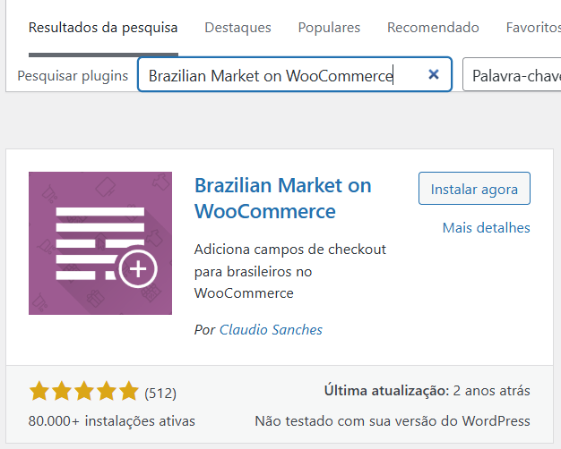
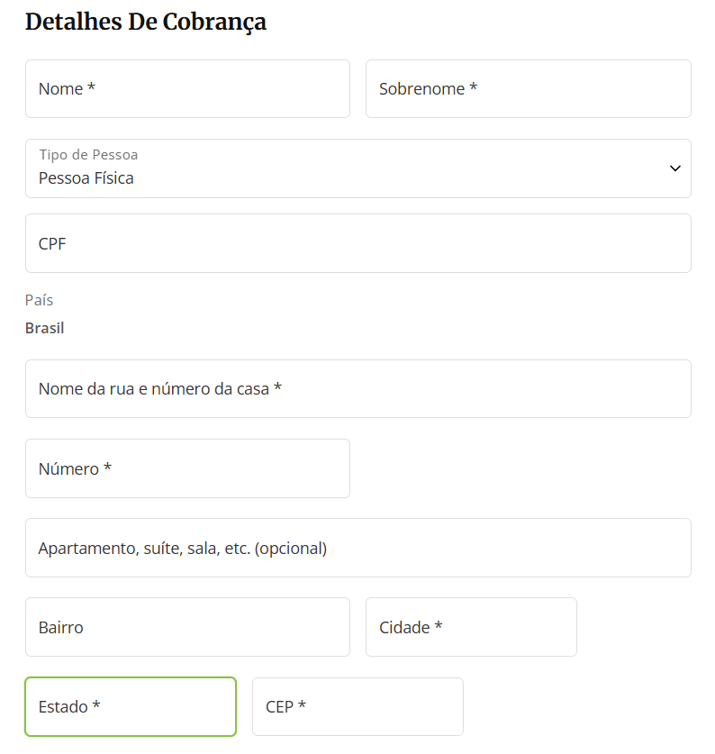

# Impostos Brasil e Adequação de Loja para Mercado Brasileiro

Muito importante para a loja ficar adequada ao mercado brasileiro, é necessário os seguintes plugins:

| Plugin                                           | Função                 |
| ------------------------------------------------ | ---------------------- |
| **WooCommerce Extra Checkout Fields for Brazil** | Campos obrigatórios    |
| **Brazilian Market on WooCommerce**              | CPF/CNPJ, CEP, estados |
| **WooCommerce Tax**                              | Regras de imposto      |

## WooCommerce Extra Checkout Fields for Brazil

Obs.: Não encontrado...

## Brazilian Market on WooCommerce

Buscar em plugins por "Brazilian Market on WooCommerce".

Após ativar, ir em WooCommerce / Configurações / Geral e realizar as configurações de país e moeda.
Em produtos, também mudar Unidades de medida para Kg e cm.

Dependendo do tema, mas será apresentado no checkout campos especificos do mercado brasileiro.

