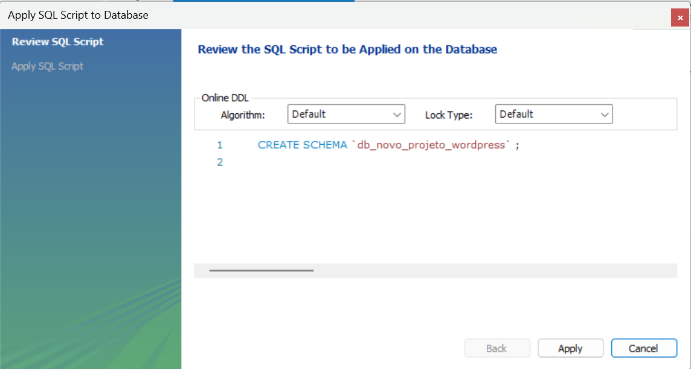
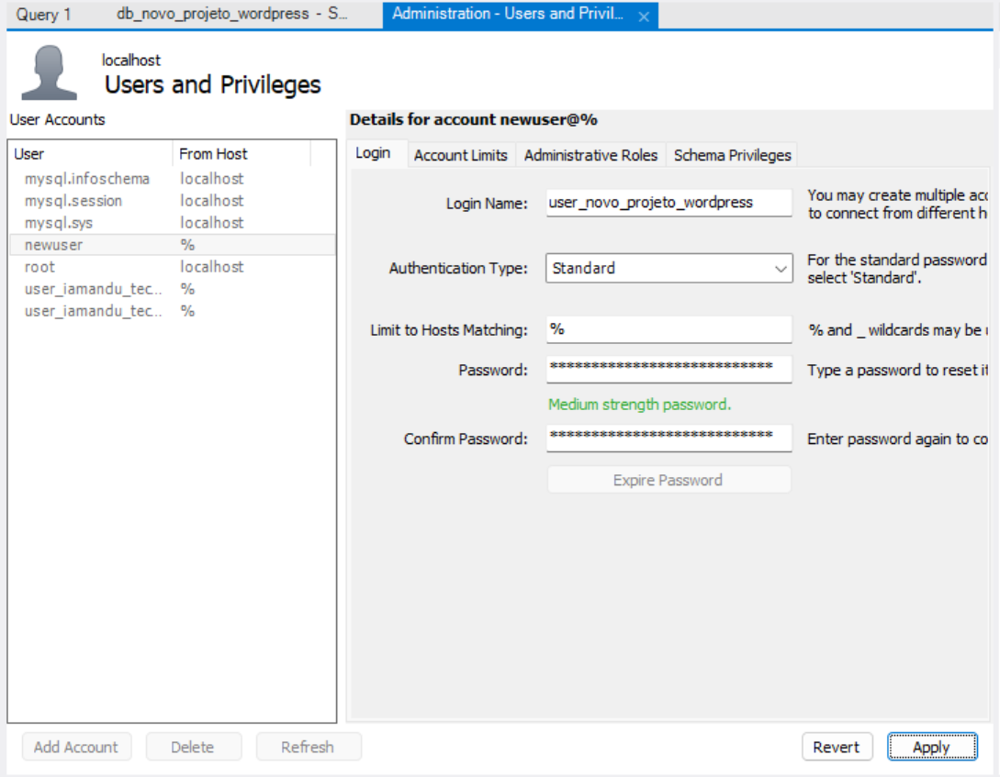
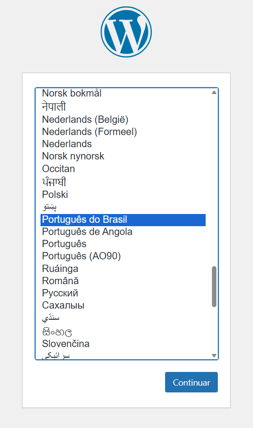
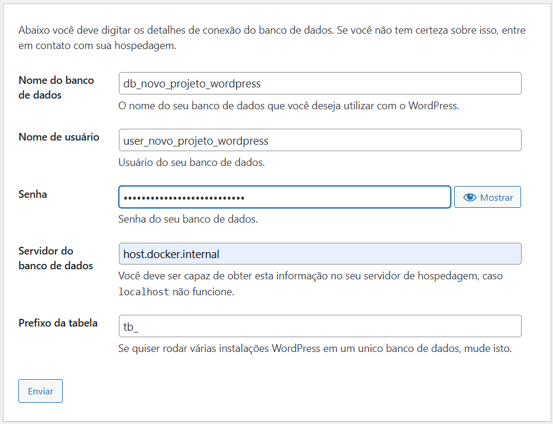
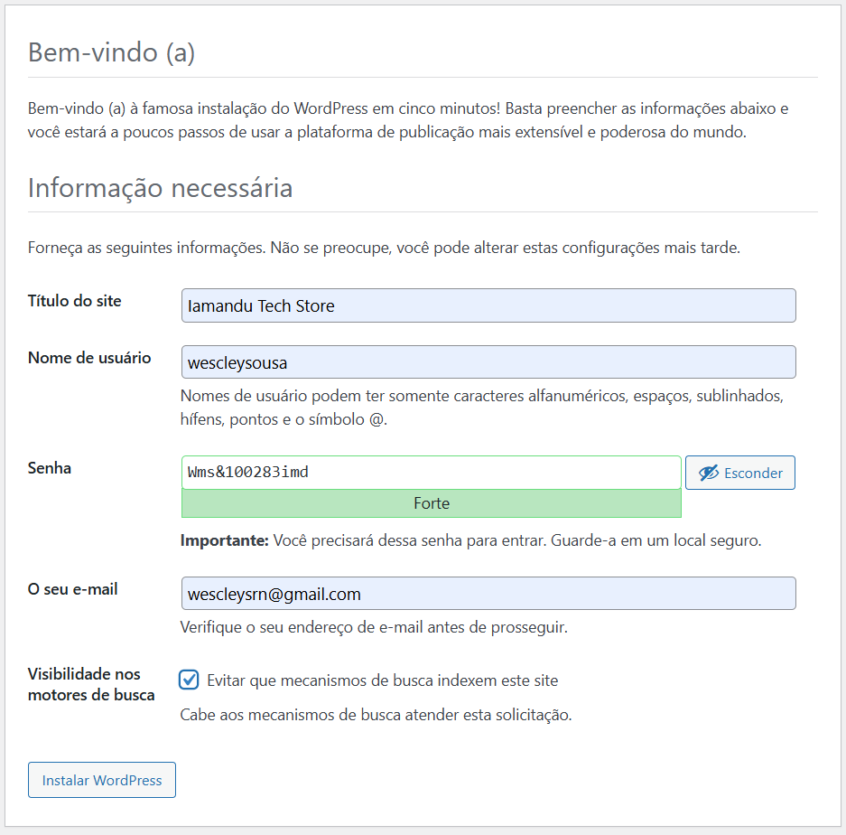
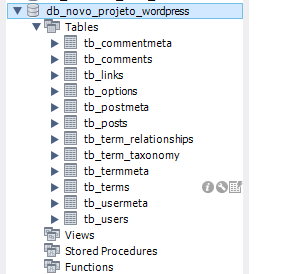
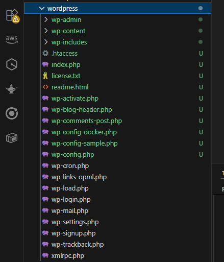
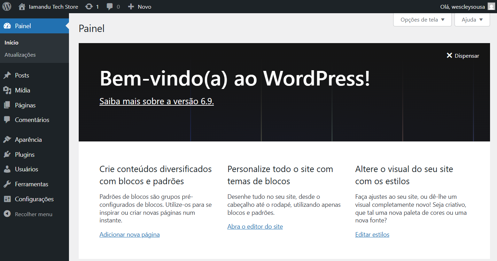
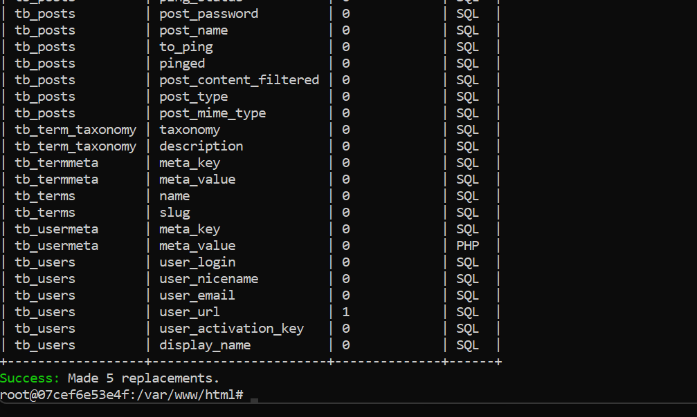
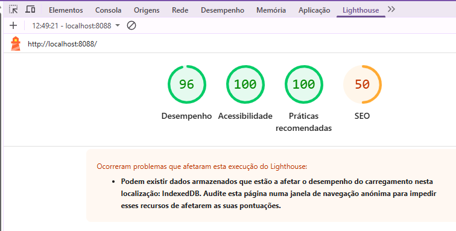

# WordPress

## Criando novo projeto localhost

Utilizando o 000-wordpress-base, basta copiar e renomear para o nome do projeto.

### Base de dados 

Deve ser preparado uma base de dados nova, supondo será usado mySQL, criar schema do banco de dados:



Se estiver usando MySQL Workbench usar aba Administration, Menu MANAGEMENT / Users and Privileges e clicar em Add Account



Na aba Schema Privileges clicar em Add Entry e escolher o banco de dados em Selected schema. Selecionar todos os grants para o schema para gerar a base, posteriormente reduzir somente aos de objeto.

Guardar as credenciais e nome do banco para utilizar na instalação.

### Instalando o Wordpress e executando pela primeira vez

Acessar a pasta do novo projeto e inicialmente executar:

```
docker compose -f docker-compose.nginx.yml up -d --build
```

É necessário esta execução pois ela é uma image wordpress com nginx e baixa o wordpress para a pasta de volume de mesmo nome. 

Uma vez em execução os containers, pelo Docker Desktop pode-se acessar o container wp_app, será observado no log:

``` 
WordPress not found in /var/www/html - copying now...
Complete! WordPress has been successfully copied to /var/www/html
``` 

Isto copia para a pasta wordpress que foi mapeada como volume o wordpress na versão base do Dockerfile.

Outro ponto para ser resolvido é o arquivo .htaccess que deve estar de acordo com o arquivo constante na raiz do projeto. Tentar copiar isso pelo Dockerfile, embora o conteúdo do wordpress é criado na primeira execução da image com nginx, então devemos realizar esta alteração manualmente.

Conteúdo .htaccess:

```
# BEGIN WordPress
# As diretrizes (linhas) entre "BEGIN WordPress" e "END WordPress" são
# geradas dinamicamente e só devem ser modificadas através de filtros do WordPress.
# Quaisquer alterações nas diretivas entre esses marcadores serão sobrescritas.
<IfModule mod_rewrite.c>
RewriteEngine On
RewriteRule .* - [E=HTTP_AUTHORIZATION:%{HTTP:Authorization}]
RewriteBase /
RewriteRule ^index\.php$ - [L]
RewriteCond %{REQUEST_FILENAME} !-f
RewriteCond %{REQUEST_FILENAME} !-d
RewriteRule . /index.php [L]
</IfModule>

# END WordPress
```

Após ser finalizado a copia, podemos acessar o serviço para instalação pelo endereço:

```
http://localhost:8080
ou
http://localhost:8080/wp-admin
```

Será exibido a primeira tela de configuração para instalar o WordPress.



Será solicitado em seguida as credenciais de banco de dados, que podem ser fornecidas conforme exemplo a seguir:



Por fim é solicitado informações básicas do site para a instalação:



Basta clicar em instalar e aguardar a instalação.

Ao finalizar no banco podemos notar a criação das tabelas básicas do wordpress:



Da mesma forma, veremos que foi criado na pasta de volume os artefatos base do projeto WordPress.



Podemos acessar portanto a administração do WordPress com usuário e senha de administrador definidos e ter acesso a plataforma para começar a trabalhar.



Configurado dados de banco de dados e definido user admin:
User: wescleysousa
Password: default + security + imd

### Migrando para o OpenLiteSpeed Server

A estrutura nginx é para dar o setup, mas para termos melhor performance passaremos o projeto para o uso da estrutura em OpenLiteSpeed que é um servidor web que pode apresentar performance até 12x melhor para sites WordPress.
Primeiramente em um terminal Windows Shell Script ou outro iremos acessar o container wp_app que até o momento roda com nginx e responde na porta 8080. Iremos executar os seguintes comandos para que na base de dados e demais locais de referência do projeto seja modificado para usar a porta 8088 padrão do servidor OpenLiteSpeed. Devemos portanto executar:

```
docker exec -it wp_app bash
```

Verificar:

```
wp --info
```

Se não estiver disponível executar: 

```
curl -O https://raw.githubusercontent.com/wp-cli/builds/gh-pages/phar/wp-cli.phar
chmod +x wp-cli.phar
mv wp-cli.phar /usr/local/bin/wp
```

Finalmente executar:

```
wp search-replace 'http://localhost:8080' 'http://localhost:8088' --skip-columns=guid --allow-root
```

Será então exibido as tabelas que sofreram alteração e a confirmação de execução com sucesso:



Em seguida aplicar a liberação de cache

```
wp cache flush --allow-root
```

Feito isso podemos no Docker Desktop parar e deletar os containers assim como remover as images.

Por fim executamos novamente o projeto usando a estrutura otimizada com o OpenLiteSpeed Server.

```
docker compose -f docker-compose.ols.yml up -d --build
```

O projeto wordpress estará disponível agora nos seguintes contextos:

```
http://localhost:8088
ou
http://localhost:8088/wp-admin
```

Pode executar o Google Lighthouse para verificar ganho de performance, que será melhor observado com a utilização de temas mais elaborados e plugins.



Uma primeira ação necessária é editar o arquivo wp-config.php na raiz de /wordpress e adicionar:

```
/* Add any custom values between this line and the "stop editing" line. */

# Determina que o wordpress faça acesso direto ao sistema de arquivo para instalação de temas e plugins, já que usamos volume localhost
define('FS_METHOD', 'direct');

/* That's all, stop editing! Happy publishing. */
```

TEMPORÁRIO: Resolver

Até conseguir resolver questão de permissões nas pastas no OLS entrar no container e habilitar permissões:

```
docker exec -it wp_ols bash
chmod -R 777 *
```

## Temas

O proximo passo é a escolha do tema para o site ou projeto. 
Estas informações podem ser obtidas na documentação especifica.

[Documentação sobre Temas WordPress](../000-docs/000_TEMAS.md)

Uma boa pratica para o exercicio da escolha do tema é realizar um backup do estado inicial do WordPress para ter este snapshot como ponto de retorno. Ou ficar fazendo a instalação e desinstalação de temas e plugins pela área administrativa.

## WooCommerce

Uma das funções mais importantes que podem ser atribuidas ao site é as funcionalidades de loja de venda online, por isso o uso do WooCommerce se mostra vantajoso.

### Meios de Pagamento

[Documentação sobre Meios de Pagamento](../000-docs/001_MEIO_PAGAMENTO.md)

### Frete e Logistica

[Documentação sobre Frete e Logistica](../000-docs/002_FRETE.md)

### Emissão de Nota Fiscal

[Documentação sobre Emissão de Nota Fiscal](../000-docs/003_NOTA_FISCAL.md)

### Contabilidade e Gestão Fiscal

[Documentação sobre Contabilidade e Gestão Fiscal](../000-docs/004_CONTABIL.md)

### Estoque

| Plugin                        | Função                       |
| ----------------------------- | ---------------------------- |
| **ATUM Inventory Manager**    | Gestão visual de estoque     |
| **WooCommerce Stock Manager** | Simples e eficaz             |
| **Backorders**                | Permite vender sob encomenda |

### Impostos Brasil

[Documentação sobre Impostos Brasil](../000-docs/009_IMPOSTOS_BRASIL.md)

## SEO, Performance e Segurança

[Documentação sobre Performance](../000-docs/007_PERFORMANCE.md)

🔍 SEO:

Rank Math ou Yoast
Schema de produto
Sitemap automático

🔐 Segurança:

Wordfence ou iThemes Security
Backup automático (UpdraftPlus)
SSL obrigatório

## Conversão e Marketing

📈 Ferramentas essenciais:

| Função              | Ferramenta                       |
| ------------------- | -------------------------------- |
| Carrinho abandonado | WooCommerce Cart Abandonment     |
| WhatsApp            | Join.chat ou WhatsApp Chat       |
| Reviews             | Customer Reviews for WooCommerce |
| Pixel Meta          | Meta Pixel for Woo               |
| Google Ads          | Google for WooCommerce           |

## Outros Plugins

| Plugin                                           | Função                 |
| ------------------------------------------------ | ---------------------- |
| **Loco Translate**                               | Tradução               |
| **Flexity Checkout para WooCommerce**            | Checkout por etapas    |
| **Parcelas Customizadas para WooCommerce**       | Parcelas de pagamento  |
| **Caddy**                                        | Carrinho lateral       |


## Hospedagem

[Documentação sobre Hospedagem](../000-docs/008_HOSPEDAGEM.md)

## Referências

